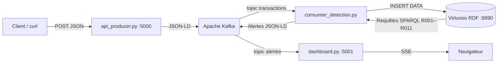

# 🔎 Détection de Fraudes Bancaires — Web Sémantique

<p align="center">
  
  
  
  
  
</p>

<p align="center">
  Un système intelligent de détection de fraudes bancaires combinant <b>Web Sémantique</b> (Virtuoso, SPARQL, RDF)
  et <b>streaming d'événements en temps réel</b> (Apache Kafka).
</p>

Ce projet modélise les transactions et les comportements suspects via une ontologie RDF, traite les flux de
transactions en continu, et affiche les alertes de fraude sur un tableau de bord interactif.

---

## 📚 Sommaire

- [Architecture du système](#️-architecture-du-système)
- [Prérequis](#-prérequis)
- [Structure du projet](#-structure-du-projet)
- [Démarrage rapide](#-démarrage-rapide)
- [🧪 Scénarios de test](#-scénarios-de-test)
- [📊 Visualiser dans Kafka UI](#-visualiser-dans-kafka-ui)
- [🖥️ Visualiser dans le Dashboard](#️-visualiser-dans-le-dashboard)
- [Vérifications rapides](#-vérifications-rapides)
- [Arrêter le projet](#-arrêter-le-projet)
- [Notes importantes](#-notes-importantes)
- [Dépannage](#-dépannage)

---

## 🏗️ Architecture du système

| # | Composant | Rôle |
|---|---|---|
| 1 | `api_producer.py` | Expose une API REST Flask qui reçoit les transactions et les publie en JSON-LD sur le topic Kafka `transactions` |
| 2 | **Apache Kafka** | Courtier de messages qui reçoit et met en file d'attente les transactions |
| 3 | `consumer_detection.py` | Consomme les transactions, les insère dans Virtuoso, exécute les 11 règles SPARQL et republie les alertes sur le topic `alertes` |
| 4 | **Virtuoso** | Base de données RDF stockant l'ontologie et les instances |
| 5 | `dashboard.py` | Backend + interface web pour visualiser les alertes en temps réel (SSE) |



---

## 📋 Prérequis

- 🐳 **Docker** et **Docker Compose**
- 🐍 **Python 3.9+**
- 📦 **pip**

---

## 📁 Structure du projet

```text
.
├── ontologies/
│   └── ontologie_complete.ttl   # Ontologie OWL + instances RDF
├── docker-compose.yml           # Virtuoso, Kafka, Kafka UI
├── requirements.txt             # Dépendances Python
├── api_producer.py              # API REST → Kafka (topic "transactions")
├── consumer_detection.py        # Kafka → Virtuoso → détection → Kafka (topic "alertes")
├── sparql_engine.py             # Moteur SPARQL : 11 règles R001–R011
├── dashboard.py                 # Dashboard temps réel (SSE)
└── README.md                    # Ce fichier
```

---

## 🚀 Démarrage rapide

### 1. Cloner le dépôt

```bash
git clone https://github.com/Mo7hamedd/FraudesBancairesOnthologyWebSemantique.git
cd FraudesBancairesOnthologyWebSemantique
```

### 2. Créer un environnement virtuel et installer les dépendances

```bash
python -m venv venv

# Windows
venv\Scripts\activate

# macOS / Linux
source venv/bin/activate

pip install -r requirements.txt
```

### 3. Démarrer l'infrastructure (Docker)

```bash
docker-compose up -d
```

**Services déployés :**

| Service | Conteneur | Port(s) | Description |
|---|---|---|---|
| **Virtuoso** | `virtuoso-db` | `8890`, `1111` | Base RDF et endpoint SPARQL |
| **Kafka** | `kafka-fraude` | `9092`, `29092`, `9093` | Courtier de messages (mode KRaft) |
| **Kafka UI** | `kafka-fraude-ui` | `8080` | Interface d'administration Kafka |

**Accès rapide :**

| Service | URL |
|---|---|
| Virtuoso Conductor | http://localhost:8890/conductor |
| Endpoint SPARQL | http://localhost:8890/sparql |
| Kafka UI | http://localhost:8080 |

> 🔑 **Identifiants Virtuoso** : `dba` / `dba`

### 4. Charger l'ontologie dans Virtuoso

Le fichier `ontologies/ontologie_complete.ttl` est monté dans le conteneur sur `/import`.

<details>
<summary><b>Option A — Via Conductor (recommandé)</b></summary>

1. Ouvre http://localhost:8890/conductor
2. Connecte-toi avec `dba` / `dba`
3. **Linked Data** → **Quad Store Upload**
4. Sélectionne `ontologie_complete.ttl`
5. **Graph IRI** : `http://localhost:8890/fraudes`
6. **Base URI** : `http://www.semanticweb.org/dell/ontologies/2026/7/Fraude-bancaires-corrigee#`

</details>

<details>
<summary><b>Option B — Via isql (ligne de commande)</b></summary>

```bash
docker exec -it virtuoso-db isql-v
```

Puis :

```sql
DB.DBA.TTLP_MT(
  file_to_string('/import/ontologie_complete.ttl'),
  'http://www.semanticweb.org/dell/ontologies/2026/7/Fraude-bancaires-corrigee#',
  'http://localhost:8890/fraudes'
);
checkpoint;
quit;
```

</details>

### 5. Lancer les composants Python

Ouvre **trois terminaux distincts** (environnement virtuel activé dans chacun) :

| Terminal | Commande | Rôle |
|---|---|---|
| 1 | `python api_producer.py` | API REST sur `:5000` |
| 2 | `python consumer_detection.py` | Détecteur de fraudes |
| 3 | `python dashboard.py` | Dashboard sur `:5001` |

---

## 🧪 Scénarios de test

### Scénario 1 — Voyage impossible (R011 + R006)

Trois transactions sur la **même carte**, en 40 minutes, Casablanca → Paris → Tokyo. Ce scénario déclenche **R011** (vitesse Haversine > 900 km/h) et **R006** (plus de 2 pays en 1 h).

**T1 — Casablanca (10:00)**
```powershell
Invoke-RestMethod -Uri "http://localhost:5000/transaction" -Method Post -ContentType "application/json" -Body '{"montant":100,"devise":"MAD","type":"Paiement","pays":"Maroc","ville":"Casablanca","latitude":33.5731,"longitude":-7.5898,"compte":"compte_809888dd","carte":"carte_test_809888dd","timestamp":"2026-09-15T10:00:00"}'
```

**T2 — Paris (10:30)**
```powershell
Invoke-RestMethod -Uri "http://localhost:5000/transaction" -Method Post -ContentType "application/json" -Body '{"montant":200,"devise":"EUR","type":"Paiement","pays":"France","ville":"Paris","latitude":48.8566,"longitude":2.3522,"compte":"compte_809888dd","carte":"carte_test_809888dd","timestamp":"2026-09-15T10:30:00"}'
```

**T3 — Tokyo (10:40)**
```powershell
Invoke-RestMethod -Uri "http://localhost:5000/transaction" -Method Post -ContentType "application/json" -Body '{"montant":300,"devise":"EUR","type":"Paiement","pays":"Japon","ville":"Tokyo","latitude":35.6762,"longitude":139.6503,"compte":"compte_809888dd","carte":"carte_test_809888dd","timestamp":"2026-09-15T10:40:00"}'
```

**Alertes attendues :**
```
R011 | Voyage Impossible | Critique | Casablanca (Maroc) → Paris (France) en 0.50 h, 1888 km → 3776 km/h (seuil 900 km/h)
R011 | Voyage Impossible | Critique | Paris (France) → Tokyo (Japon) en 0.17 h, 9712 km → 58270 km/h (seuil 900 km/h)
R006 | Multi Pays        | Critique | 3 pays en 60 min (seuil 2)
```

---

### Scénario 2 — Montant critique (R001 + R007 + R009)

Une transaction de **8 000 EUR** depuis la localisation habituelle (MaryBourg, France), pour éviter R002 (pays) et R010 (localisation). Ce scénario déclenche **R009** (plafond carte 5 000), **R001** (seuil global 5 000) et **R007** (3× la moyenne historique).

```powershell
Invoke-RestMethod -Uri "http://localhost:5000/transaction" -Method Post -ContentType "application/json" -Body '{"montant":8000,"devise":"EUR","type":"Paiement","pays":"France","ville":"MaryBourg","latitude":48.8566,"longitude":2.3522,"compte":"compte_809888dd","carte":"carte_test_809888dd","timestamp":"2026-09-20T14:00:00"}'
```

**Alertes attendues :**
```
R001 | Montant    | Critique | Montant 8000 > seuil 5000.0
R007 | Historique | Elevee   | 8000 > 3.0x moyenne (...)
R009 | Plafond    | Elevee   | Montant 8000 > plafond 5000
```

---

## 📊 Visualiser dans Kafka UI

Kafka UI est accessible sur **http://localhost:8080** après `docker-compose up -d`.

### 1. Vérifier que le cluster est online

À l'ouverture, la page d'accueil liste les clusters disponibles. Tu dois voir :

```
fraude-local    online    3 brokers
```

*(Le nom du cluster est défini dans `docker-compose.yml` via `KAFKA_CLUSTERS_0_NAME`.)*

### 2. Explorer le topic `transactions`

1. Menu de gauche → **Topics** → clique sur **`transactions`**
2. Onglet **Messages**
3. Tu vois les messages JSON-LD publiés par `api_producer.py` :

```json
{
  "@context": { "@vocab": "http://www.semanticweb.org/dell/...#" },
  "@type": "Transaction",
  "@id": "txn_135f5b98",
  "transactionAmount": { "@value": 100.0, "@type": "xsd:decimal" },
  "transactionCurrency": "MAD",
  "hasSource": { "@id": "compte_809888dd" },
  "hasLocation": {
    "@type": "Localisation",
    "locationCountry": "Maroc",
    "locationCity": "Casablanca",
    "locationLatitude": { "@value": 33.5731, "@type": "xsd:double" },
    "locationLongitude": { "@value": -7.5898, "@type": "xsd:double" }
  }
}
```

**Chaque POST sur `http://localhost:5000/transaction` ajoute un message ici.**

> 💡 Clique sur **Produce Message** pour publier manuellement un message de test sans passer par l'API.

### 3. Explorer le topic `alertes`

1. Menu de gauche → **Topics** → clique sur **`alertes`**
2. Onglet **Messages**
3. Tu vois les alertes publiées par `consumer_detection.py` :

```json
{
  "@context": { "@vocab": "http://www.semanticweb.org/dell/...#" },
  "@type": "AlerteFraudeVoyageImpossible",
  "@id": "alerte_f788fd03",
  "alertType": "R011",
  "alertSeverity": "Critique",
  "alertDescription": "Voyage impossible : Casablanca (Maroc) → Paris (France) en 0.50 h, 1888 km → 3776 km/h (seuil 900 km/h)",
  "alertTimestamp": { "@value": "2026-09-27T10:00:00", "@type": "xsd:dateTime" },
  "triggeredBy": { "@id": "txn_fabd9f8b" },
  "triggersRule": { "@id": "regle_R011" }
}
```

> 💡 Chaque alerte correspond à une règle déclenchée. Le champ `@type` indique la **sous-classe OWL** d'alerte (ici `AlerteFraudeVoyageImpossible`).

### 4. Filtrer les messages

- **Par clé** : la plupart des messages n'ont pas de clé, mais tu peux en ajouter une côté producteur.
- **Par offset** : saisis un offset précis dans la barre de recherche.
- **Live tail** : active le bouton **Live** (en haut à droite) pour voir les nouveaux messages en temps réel sans rafraîchir.

---

## 🖥️ Visualiser dans le Dashboard

Le dashboard est accessible sur **http://localhost:5001** (ou le port affiché par `dashboard.py` au démarrage).

### 1. Onglet « Temps réel »

C'est la vue principale. Elle affiche les alertes reçues via SSE (Server-Sent Events) depuis le topic Kafka `alertes`.

**Format de chaque ligne :**

| Heure | Règle | Type d'alerte | Sévérité | Description | Transaction |
|---|---|---|---|---|---|
| 10:40:02 | R011 | Voyage Impossible | Critique | Paris (France) → Tokyo (Japon) en 0.17 h, 9712 km → 58270 km/h | txn_00fc0ee8 |
| 10:40:02 | R006 | Multi Pays | Critique | 3 pays en 60 min (seuil 2) | txn_00fc0ee8 |
| 10:30:01 | R011 | Voyage Impossible | Critique | Casablanca (Maroc) → Paris (France) en 0.50 h, 1888 km → 3776 km/h | txn_fabd9f8b |

**Actions disponibles :**
- **Pause / Reprendre** : met en pause le flux SSE pour lire les alertes sans défilement.
- **Filtre par sévérité** : affiche uniquement les alertes `Critique`, `Elevee` ou `Moyenne`.
- **Filtre par règle** : affiche uniquement R001, R002, … R011.

### 2. Onglet « Analytics »

Vue agrégée des alertes :
- Nombre d'alertes par règle (graphique barres)
- Répartition par sévérité (camembert)
- Évolution temporelle des détections (courbe)

> ⚠️ **Prérequis** : Virtuoso doit être joignable. Si l'onglet affiche `WinError 10061`, vérifie que `docker ps` montre bien `virtuoso-db` en `Up`.

### 3. Vérifier qu'une alerte est bien arrivée

1. Envoie un scénario de test (voir section [Scénarios de test](#-scénarios-de-test)).
2. Regarde la **console du consumer** — tu dois voir :

```
[013] ─── txn_50992f6f ───
     Montant : 8000.0 EUR | Paiement
     Lieu    : MaryBourg, France (lat=48.8566, lng=2.3522)
     [OK] Transaction insérée dans Virtuoso
     ⚠️  3 alerte(s) détectée(s) :
          [R001] Critique — Montant 8000 > seuil 5000.0
          [R007] Elevee   — 8000 > 3.0x moyenne (556.22)
          [R009] Elevee   — Montant 8000 > plafond 5000
     [OK] Alertes publiées sur 'alertes'
```

3. Bascule sur le dashboard — les mêmes alertes apparaissent en moins d'une seconde.

### 4. Si le dashboard n'affiche rien

| Cause | Correctif |
|---|---|
| `auto_offset_reset="latest"` | Change-le en `"earliest"` dans `dashboard.py` |
| Ancien `group_id` | Change `group_id` (ex. `"dashboard-v2"`) pour forcer la relecture depuis le début |
| Consumer Kafka en double | `Get-Process python` → tue les doublons, relance un seul dashboard |

---

## 🧪 Vérifications rapides

**Virtuoso répond ?**
```powershell
Invoke-WebRequest -Uri "http://localhost:8890/sparql" -Method GET -ErrorAction SilentlyContinue | Select-Object StatusCode
```

**Kafka tourne ?** → http://localhost:8080, cluster `fraude-local` **online**.

**Combien d'alertes par règle ?**
```sparql
PREFIX : <http://www.semanticweb.org/dell/ontologies/2026/7/Fraude-bancaires-corrigee#>

SELECT ?regle (COUNT(?a) AS ?nb)
WHERE {
  GRAPH <http://localhost:8890/fraudes> {
    ?a a :AlerteFraude ; :alertType ?regle .
  }
}
GROUP BY ?regle
ORDER BY ?regle
```

**Statistiques globales :**
```sparql
PREFIX : <http://www.semanticweb.org/dell/ontologies/2026/7/Fraude-bancaires-corrigee#>

SELECT ?clients ?comptes ?cartes ?transactions ?triples
WHERE {
  { SELECT (COUNT(DISTINCT ?c) AS ?clients) WHERE {
      GRAPH <http://localhost:8890/fraudes> { ?c a :Client } } }
  { SELECT (COUNT(DISTINCT ?cpt) AS ?comptes) WHERE {
      GRAPH <http://localhost:8890/fraudes> { ?cpt a :CompteBancaire } } }
  { SELECT (COUNT(DISTINCT ?cb) AS ?cartes) WHERE {
      GRAPH <http://localhost:8890/fraudes> { ?cb a :CarteBancaire } } }
  { SELECT (COUNT(DISTINCT ?t) AS ?transactions) WHERE {
      GRAPH <http://localhost:8890/fraudes> { ?t a :Transaction } } }
  { SELECT (COUNT(*) AS ?triples) WHERE {
      GRAPH <http://localhost:8890/fraudes> { ?s ?p ?o } } }
}
```

---

## 🛑 Arrêter le projet

```bash
docker-compose down
```

Arrêter les scripts Python : `Ctrl+C` dans chaque terminal.

Supprimer également les volumes de données :

```bash
docker-compose down -v
```

---

## 📝 Notes importantes

- Le fichier `ontologie_complete.ttl` contient **l'ontologie et les instances** extraites de Virtuoso.
- Le graphe utilisé est `http://localhost:8890/fraudes`.
- **Tous les seuils sont lus dans l'ontologie** (`:ruleThreshold`, `:ruleWindowMinutes`, `:ruleMultiplier`, etc.). Modifier un seuil se fait par SPARQL, sans toucher au code Python.
- Après modification de `sparql_engine.py`, **redémarre le consumer** (Python ne recharge pas les modules à chaud).

---

## 🩹 Dépannage

| Problème | Piste de résolution |
|---|---|
| Virtuoso ne répond pas | `docker ps` → attendre ~30 s après `docker-compose up -d` |
| Kafka UI inaccessible | Vérifie que le port `8080` est libre |
| Aucune alerte sur le dashboard | Vérifie que l'ontologie est chargée et que les 3 scripts tournent |
| `Impossible de se connecter au serveur distant` | Un des services Python est arrêté — relance-le |
| R011 ne se déclenche pas | Vérifie que les coordonnées sont en `xsd:double` et que `:regle_R011` existe |
| R004 ne se déclenche pas | Vérifie que `:ruleWindowMinutes` existe dans Virtuoso et redémarre le consumer |
| Erreur SPARQL « syntax error » | Vérifie que tu n'as pas collé du SQL dans l'endpoint SPARQL |

---

<p align="center">
  Projet Web Sémantique - Détection de Fraudes
</p>
